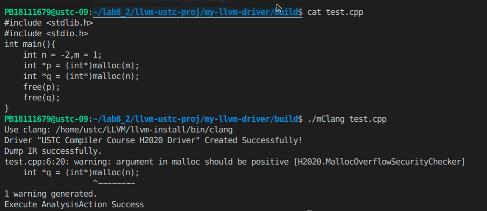
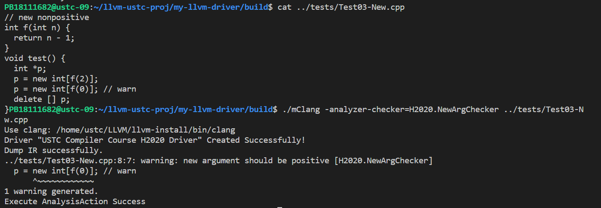
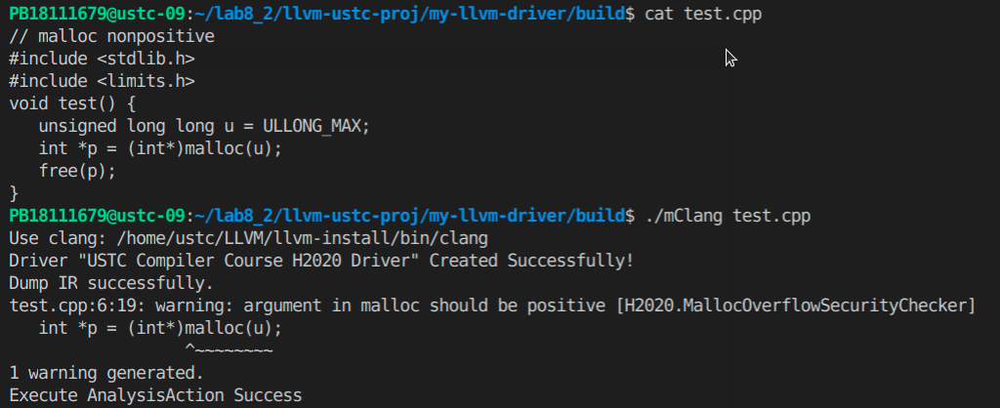

### 动态分配内存检查

#### 检查目标
在这里，我们参考 `list of potential checker`，针对`malloc` 中参数为负数以及 `new` 中参数为负数的情况进行检查。实际上，`malloc`和`new`的参数为64位无符号整数，如果其实际参数为一个负数的话，那么这个负数会转化成一个很大的64位无符号整数（大于等于$ 2^{63}$），而一般情况下，操作系统是无法动态分配如此大的内存空间的，因此我们可以在实际参数为负数的情况下报出警告。


#### 实现思路
在 `Clang Static Analyzer` 遍历 `CFG` 检测的过程中，我们在每一个函数调用前，调用 `checkPreStmt` 进行分析。如果这个函数是`malloc`或`new`,就对函数的参数进行检查。通过 `ConstraintManager` 提供的 `assumeInclusiveRangeDual`方法对符号值进行约束，通过约束的结果，判断出原来的参数是否为负数，并在程序点处报出错误。

`malloc`中得到参数和判断参数是否为正对应的代码：

```c++
  if( CE->getDirectCallee()->getNameAsString() == "malloc" ) {
    // get Symbolic value of argument
    const Expr *arg1 = CE->getArg(0);
    SVal Argument = C.getSVal(arg1);
    Optional<NonLoc> NL = Argument.getAs<NonLoc>();
    // return as the argument is not a concrete int
    if(!NL || NL->getSubKind() != nonloc::ConcreteIntKind){
        return;
    }
    // get the bit width of argument
    const auto Value = NL->castAs<nonloc::ConcreteInt>().getValue();
    unsigned Width =  Value.getBitWidth();
    ConstraintManager &CM = C.getConstraintManager();
    // two kinds of programstate
    ProgramStateRef stateNonPositive, statePositive;
    // whether the argument is unsigned or not
    bool isUnsigned = Value.isUnsigned();
    // check whether the argument is positive
    std::tie(stateNonPositive, statePositive)
      = CM.assumeInclusiveRangeDual(C.getState(), 
          *NL,
          llvm::APSInt(llvm::APInt(Width, 1), isUnsigned),
          llvm::APSInt(llvm::APInt(Width, pow(2,Width-1) - 1),isUnsigned) );
```

`new`中得到参数对应的代码（判断正负与`malloc`相同）：

```c++
    unsigned implicitargs = Call.getNumImplicitArgs();
    const Expr * arg1=nullptr;
    if (const CallExpr *CE = dyn_cast<CallExpr>(Call.getOriginExpr())) {
        arg1 = CE->getArg(0);
    }
    else if (const CXXNewExpr *NE = dyn_cast<CXXNewExpr>(Call.getOriginExpr())) {
        if (NE->isArray()) {
            arg1 = *NE->getArraySize();
        } 
        else {
            return;
        }
    }
    else {
        llvm_unreachable("not a CallExpr or CXXNewExpr");
    }

    // get symbolic value of argument
    SVal Argument = C.getSVal(arg1);
```

#### 效果展示
如下图所示，在 `main` 函数中，第一次调用 `malloc` 时实际参数为1，没有提醒；第二次调用 `malloc` 时实际参数为`-2`,产生了一个提醒,要求 `malloc` 的参数为正数。


下图为`new`的测试，第一次调用参数为1，正确第二次调用参数变为-1，报`warning`，提醒`new`的参数应该是正数。



#### 无法分析的问题

如下图所示，在`main`函数中，`malloc` 函数的实际参数为不确定的输入值。在这里我选择不报错，因此这样可能会产生 `false negative` 的情况。


另外，当用户真的需要动态分配非常大的内存时，这个 `checker` 可能会把一个非常大的无符号整数当成一个负数。虽然这样的内存分配一般不会成功，但是其无法成功的原因是内存不足，而非 `malloc` 参数为负数。所以这里会产生一个 `false positive` 的错误。


