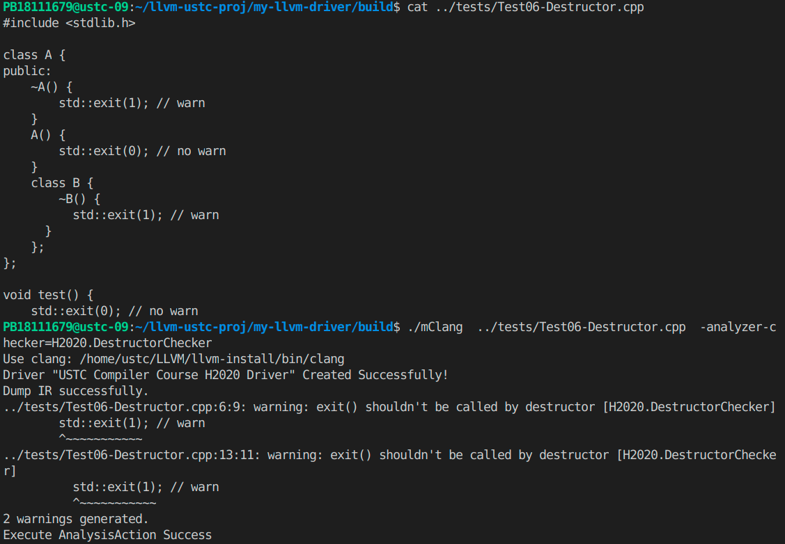

## 内存检查

### 动态分配参数检查

#### 1.检查目标
在这里，我们参考 `list of potential checker`，针对 `malloc` 中参数为负数的情况进行检查。实际上，`malloc` 的参数为64位无符号整数，如果其实际参数为一个负数的话，那么这个负数会转化成一个很大的64位无符号整数（大于等于$ 2^{63}$），而一般情况下，操作系统是无法动态分配如此大的内存空间的，因此我们可以在实际参数为负数的情况下报出警告。


#### 2.实现思路
在 `Clang Static Analyzer` 遍历 `CFG` 检测的过程中，我们在每一个函数调用前，调用 `checkPreStmt` 进行分析。如果这个函数是`malloc`,就对 `malloc` 函数的参数进行检查。通过 `ConstraintManager` 提供的 `assumeInclusiveRangeDual`方法对符号值进行约束，通过约束的结果，判断出原来的参数是否为负数，并在程序点处报出错误。

#### 3.效果展示
如下图所示，在 `main` 函数中，第一次调用 `malloc` 时实际参数为1，没有提醒；第二次调用 `malloc` 时实际参数为`-2`,产生了一个提醒,要求 `malloc` 的参数为正数。


#### 4.无法分析的问题
如下图所示，在`main`函数中，`malloc` 函数的实际参数为不确定的输入值。在这里我选择不报错，因此这样可能会产生 `false negative` 的情况。


另外，当用户真的需要动态分配非常大的内存时，这个 `checker` 可能会把一个非常大的无符号整数当成一个负数。虽然这样的内存分配一般不会成功，但是其无法成功的原因是内存不足，而非 `malloc` 参数为负数。所以这里会产生一个 `false positive` 的错误。


### 指针越界检查

#### 1.检查目标
当调用 `strcpy(dst,src)` 的时候，可能由于目标指针`dst`所指向的内存空间大小小于复制字符串的长度，从而出现内存非法访问的问题。此时，我们修改了 `CStringChecker` 的代码来跟踪检查经过`malloc`得到的指针，通过比较这些指针指向内存空间的大小，从而判断strcpy是否会有问题。

#### 2.实现思路
在`CFG` 的`malloc`函数调用后，`CStringChecker`调用了`checkPostCall`函数，里面类似于`SimpleStreamChecker`，使用一个全局映射 `PointerMemMap` 记录 `malloc` 得到的指针所指向内存空间的大小。由于这里的map的

#### 3.效果展示


#### 4.无法分析的问题

### 析构函数检查


#### 1.检查目标
我们希望检查析构函数中是否有 `exit` 函数和 `throw` 语句。如果有这些语句，那么析构函数没办法正常结束，因此会导致变量的内存不能被正常释放从而造成了内存泄露。所以，我们写了 `DestructorChecker` 和`DestructorThrowChecker` 分别检查以上两种情况。

#### 2.设计思路
首先，我们需要知道当前程序状态点是否在析构函数中。在这里，我们使用全局的布尔变量 `inDestructor` 来标记。在CFG上进入一个函数的时候，检查器通过调用 `checkBeginFunction`，利用 `CheckerContext` 对象提供的上下文信息，来判断这个函数是否为析构函数。当这个函数为析构函数的时候，将 `inDestructor` 置位为 `true`。当在CFG上离开一个函数的时候，检查器调用 `checkEndFunction`，将 `inDestructor` 复位为 `false`。

在遍历 `CFG` 的析构函数的每一个函数表达式之前， `DestructorChecker` 调用 `checkPreStmt` 判断其是否为 `exit` 函数，如果是，则报出警告；`DestructorThrowChecker` 调用 `checkPreStmt`，通过遍历其函数体的 `AST` 来查找这个函数中是否有 `throw` 语句。`DestructorChecker` 判断 `exit` 函数的代码如下：
```cpp
void DestructorChecker::checkPreStmt(const CallExpr *CE,CheckerContext &C) const {
    if(inDestructor && CE->getDirectCallee()->getNameAsString() == "exit") {
        // report bug
        if (!BT) {
            BT.reset(new BugType(this,
            "exit() shouldn't be called by destructor","DestructorChecker"));
        }
        ExplodedNode *N = C.generateErrorNode();
        auto Report = std::make_unique<PathSensitiveBugReport>(*BT,
                        "exit() shouldn't be called by destructor",N);
        // report explicitly
        C.emitReport(std::move(Report));
    }
}
```
而DestructorThrowChecker判断是否有throw语句的代码如下：
```cpp

void DestructorThrowChecker::checkPreStmt(const CallExpr *CE, CheckerContext &C) const {
    if(inDestructor3) {
        const FunctionDecl* D = CE->getDirectCallee();
        if (!D) {
            return;
        }
        const Stmt* S = D->getDefinition()->getBody();
        for (const auto *Child : S->children()) {
            const CXXThrowExpr* TE = dyn_cast<CXXThrowExpr>(Child);
            if (!TE) {
                return;
            }
            if (!BT) {
                BT.reset(new BugType(this,
                "throw shouldn't be declared by destructor","DestructorStaChecker"));
            }
            ExplodedNode *N = C.generateErrorNode();
            auto Report = std::make_unique<PathSensitiveBugReport>(*BT,
                            "static variable shouldn't be declared by destructor",N);
            // report explicitly
            C.emitReport(std::move(Report));
        }
    }
}
```

#### 3.效果展示
使用`DestructorThrowChecker` 分析以下的程序会警告throw不能在析构函数中被使用，说明这里可以正常分析。

使用 `DestructorChecker`分析以下的程序，会对析构函数中的exit进行警告，对构造函数以及main函数则不会警告。



### 静态函数的分析
