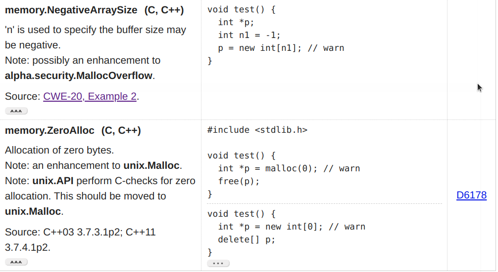
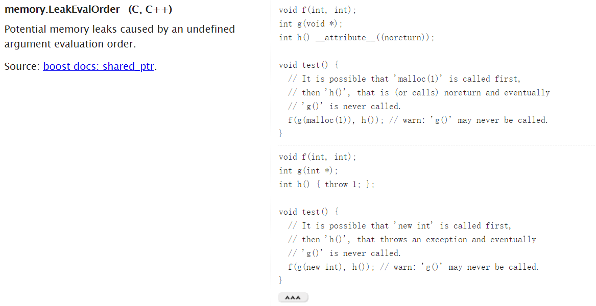
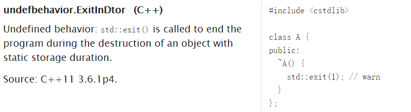
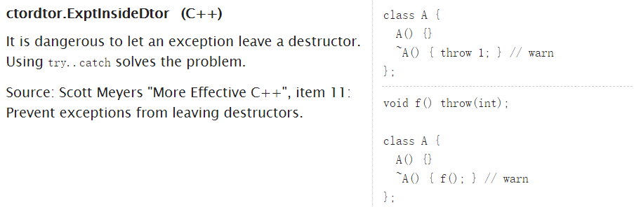

# G1 Clang Static Checker 技术文档

本文档由中科大2020编译原理H的G1小组开发，主要展示了我们小组实现的`Clang Static Checker(CSA)`、如何利用测试脚本进行测试、以及对答辩时互动提问的记录。

[TOC]
## Checker介绍

以下介绍的 `Clang Static Checker` 是我们小组成员参考[`list of potential checkers`](https://clang-analyzer.llvm.org/potential_checkers.html)以及现有的检查器,修改 `clang` 源码并在 `my-llvm-driver` 上运行实现的。

我们写的 `checker` 主要分为动态内存分配检查，析构函数检查以及静态变量检查三大类。

### 动态内存分配检查

#### malloc/new的实参是否为正数: MallocOverflowSecurityChecker 和 NewArgChecker

##### 检查目标
在这里，我们参考 `list of potential checker`，针对`malloc` 中参数为负数以及 `new` 中参数为负数的情况进行检查。实际上，`malloc`和`new`的参数为64位无符号整数，如果其实际参数为一个负数的话，那么这个负数会转化成一个很大的64位无符号整数（大于等于$ 2^{63}$），而一般情况下，操作系统是无法动态分配如此大的内存空间的，因此我们可以在实际参数为负数的情况下报出警告。所以，我们分别实现了 `MallocOverflowSecurityChecker` 和 `NewArgChecker`来分别检查 `malloc` 和 `new`。


##### 实现思路
在 `Clang Static Analyzer` 遍历 `CFG` 检测的过程中，我们在每一个函数调用前，调用 `checkPreStmt` 进行分析。如果这个函数是`malloc`或`new`,就对函数的参数进行检查。通过 `ConstraintManager` 提供的 `assumeInclusiveRangeDual`方法对符号值进行约束，通过约束的结果，判断出原来的参数是否为负数，并在程序点处报出错误。

`malloc`中得到参数和判断参数是否为正对应的代码：

```c++
  if( CE->getDirectCallee()->getNameAsString() == "malloc" ) {
    // get Symbolic value of argument
    const Expr *arg1 = CE->getArg(0);
    SVal Argument = C.getSVal(arg1);
    Optional<NonLoc> NL = Argument.getAs<NonLoc>();
    // return as the argument is not a concrete int
    if(!NL || NL->getSubKind() != nonloc::ConcreteIntKind){
        return;
    }
    // get the bit width of argument
    const auto Value = NL->castAs<nonloc::ConcreteInt>().getValue();
    unsigned Width =  Value.getBitWidth();
    ConstraintManager &CM = C.getConstraintManager();
    // two kinds of programstate
    ProgramStateRef stateNonPositive, statePositive;
    // whether the argument is unsigned or not
    bool isUnsigned = Value.isUnsigned();
    // check whether the argument is positive
    std::tie(stateNonPositive, statePositive)
      = CM.assumeInclusiveRangeDual(C.getState(), 
          *NL,
          llvm::APSInt(llvm::APInt(Width, 1), isUnsigned),
          llvm::APSInt(llvm::APInt(Width, pow(2,Width-1) - 1),isUnsigned) );
```

`new`中得到参数对应的代码（判断正负与`malloc`相同）：

```c++
    unsigned implicitargs = Call.getNumImplicitArgs();
    const Expr * arg1=nullptr;
    if (const CallExpr *CE = dyn_cast<CallExpr>(Call.getOriginExpr())) {
        arg1 = CE->getArg(0);
    }
    else if (const CXXNewExpr *NE = dyn_cast<CXXNewExpr>(Call.getOriginExpr())) {
        if (NE->isArray()) {
            arg1 = *NE->getArraySize();
        } 
        else {
            return;
        }
    }
    else {
        llvm_unreachable("not a CallExpr or CXXNewExpr");
    }

    // get symbolic value of argument
    SVal Argument = C.getSVal(arg1);
```

##### 效果展示
对以下测试程序，调用 `malloc` 时实际参数为`0`。
```cpp
// malloc nonpositive
#include <stdlib.h>
void test() {
  int *p = (int *) malloc(0);
  free(p);
}
```
结果产生了一个提醒 `argument in malloc should be positive`,要求 `malloc` 的参数为正数。
```
PB18111679@ustc-09:~/llvm-ustc-proj/my-llvm-driver$ ./build/mClang ./tests/Test01-Malloc.cpp        -analyzer-checker=H2020.MallocOverflowSecurityChecker
Use clang: /home/ustc/LLVM/llvm-install/bin/clang
Driver "USTC Compiler Course H2020 Driver" Created Successfully! 
Dump IR successfully.
./tests/Test01-Malloc.cpp:4:20: warning: argument in malloc should be positive [H2020.MallocOverflowSecurityChecker]
  int *p = (int *) malloc(0);
                   ^~~~~~~~~
1 warning generated.
Execute AnalysisAction Success
1 warning generated.
```


下图为`new`的测试，第一次调用参数为1，正确;第二次调用参数变为-1，报`warning`，提醒`new`的参数应该是正数。
```cpp
// new nonpositive
int f(int n) {
  return n - 1;
}
void test() {
  int *p;
  p = new int[f(2)];
  p = new int[f(0)]; // warn
  delete [] p;
}
```
输出如下，说明此时可以正确检测。
```
PB18111679@ustc-09:~/llvm-ustc-proj/my-llvm-driver$ ./build/mClang ./tests/Test03-New.cpp           -analyzer-checker=H2020.NewArgChecker
Use clang: /home/ustc/LLVM/llvm-install/bin/clang
Driver "USTC Compiler Course H2020 Driver" Created Successfully! 
Dump IR successfully.
./tests/Test03-New.cpp:8:7: warning: new argument should be positive [H2020.NewArgChecker]
  p = new int[f(0)]; // warn
      ^~~~~~~~~~~~~
1 warning generated.
Execute AnalysisAction Success
1 warning generated.
```

##### 无法分析的问题

如下图所示，在`main`函数中，`malloc` 函数的实际参数为不确定的输入值。
```cpp
#include <stdio.h>
#include <stdlib.h>
int main(){
    int n = -2;
    scanf("%d",&n);
    int *p = (int*)malloc(n);
    free(p);
}
```

在这里 `checker` 选择不报错，因此这样可能会产生 `false negative` 的情况。
```
PB18111679@ustc-09:~/llvm-ustc-proj/my-llvm-driver$ ./build/mClang ./tests/test.cpp        -analyzer-checker=H2020.MallocOverflowSecurityCheckerUse clang: /home/ustc/LLVM/llvm-install/bin/clang
Driver "USTC Compiler Course H2020 Driver" Created Successfully! 
Dump IR successfully.
Execute AnalysisAction Success
```

另外，当用户真的需要动态分配非常大的内存时，这个 `checker` 可能会把一个非常大的无符号整数当成一个负数。
```cpp
// malloc 2^64 - 1
#include <stdlib.h>
#include <limits.h>
void test() {
  unsigned long long u = ULLONG_MAX;
  int *p = (int *) malloc(u);
  free(p);
}
```
虽然这样的内存分配一般不会成功，但是其无法成功的原因是内存不足，而非 `malloc` 参数为负数。所以这里会产生一个 `false positive` 的错误。
```
PB18111679@ustc-09:~/llvm-ustc-proj/my-llvm-driver$ ./build/mClang ./tests/Test02-Malloc.cpp        -analyzer-checker=H2020.MallocOverflowSecurityChecker
Use clang: /home/ustc/LLVM/llvm-install/bin/clang
Driver "USTC Compiler Course H2020 Driver" Created Successfully! 
Dump IR successfully.
./tests/Test02-Malloc.cpp:6:20: warning: argument in malloc should be positive [H2020.MallocOverflowSecurityChecker]
  int *p = (int *) malloc(u);
                   ^~~~~~~~~
1 warning generated.
Execute AnalysisAction Success
1 warning generated.
```

#### 参数顺序造成的内存泄漏: LeakEvalOrderChecker

##### 检查目标

在一个函数调用参数的时候，假如位置在先的参数是一个函数并且开辟了新的内存空间，而位置在后的参数没有返回的情况下，就可能会造成位置在先的函数没有被调用，内存泄漏。



##### 实现思路

检查每个函数的参数中是否含有开辟新的内存空间的函数和没有返回的函数共存的情况。

`getNoReturn()`检查是否有返回值：

```c++
bool LeakEvalOrderChecker::getNoReturn(const CallExpr *CE,CheckerContext &C) const {
    const FunctionDecl* D = CE->getDirectCallee();
    if (!D) {
        return false;
    }
    if (D->isNoReturn()) {
        return true;
    }
    if (!D->getDefinition()) {
        return false;
    }
    const Stmt* S = D->getDefinition()->getBody();
    for (const auto *Child : S->children()) {
        const CXXThrowExpr* TE = dyn_cast<CXXThrowExpr>(Child);
        if (TE) {
            return true;
        }
        const CallExpr* CC = dyn_cast<CallExpr>(Child);
        if (CC) {
            D = CC->getDirectCallee();
            if (D && D->isNoReturn()) {
                return true;
            }
        }
    }
    return false;
}
```

`getMallocOrNew()`检查是否有开辟内存空间：

```c++
bool LeakEvalOrderChecker::getMallocOrNew(const CallExpr *CE,CheckerContext &C) const {
    if(!CE->getNumArgs()) {
        return false;
    }
    if (CE->getDirectCallee()->getNameAsString() == "malloc") {
        return true;
    }
    const CXXNewExpr *NE = dyn_cast<CXXNewExpr>(CE->getArg(0));
    if (NE) {
        return true;
    }
    return false;
}
```

检查参数中是否同时含有这两种函数，如果是的话，报告warning：

```c++
    for (unsigned i = 0; i < num; i++) {
        const CallExpr* CallArg = dyn_cast<CallExpr>(CE->getArg(i));
        if (!CallArg) {
            continue;
        }
        const ReturnAndMalloc* RAM = State->get<MemLeakMap>(CallArg);
        if (RAM) {
            NoReturn |= RAM->getNoReturn();
            MallocOrNew |= RAM->getMallocOrNew();
        }
    }
    if (NoReturn && MallocOrNew) {
        ReportBug(C);
        return;
    }
```

##### 效果展示
在以下例子中，可能出现以下情况：在调用函数 `f` 的时候，先为函数 `g` 动态分配 `int` 参数，再调用函数 `h` 退出。这样的话可能会造成内存泄露。
```cpp
#include <stdlib.h>
void f(int, int);
int g(int *);
int h() {
    exit(0);
};

void test() {
  // It is possible that 'new int' is called first,
  // then 'h()', that throws an exception and eventually
  // 'g()' is never called.
  f(g(new int), h()); // warn: 'g()' may never be called.
}
```
而 `LeakEvalOrderChecker` 也对这种情况给与了提醒。
```
Driver "USTC Compiler Course H2020 Driver" Created Successfully! 
Dump IR successfully.
./tests/Test09-LeakEval.cpp:12:3: warning: There may be memory leaks [H2020.LeakEvalOrderChecker]
  f(g(new int), h()); // warn: 'g()' may never be called.
  ^~~~~~~~~~~~~~~~~~
1 warning generated.
Execute AnalysisAction Success
1 warning generated.
```

#### 动态内存分配的指针在strcpy中是否安全：CStringChecker

##### 检查目标
当调用 `strcpy(dst,src)` 的时候，可能由于目标指针 `dst` 所指向的内存空间大小小于复制字符串的长度，从而出现内存非法访问的问题。此时，我们修改了 `CStringChecker` 的代码来跟踪检查经过 `malloc` 得到的指针，通过比较这些指针指向内存空间的大小，从而判断 `strcpy` 是否会有问题。

##### 实现思路
在`CFG` 的 `malloc` 函数调用后，`CStringChecker` 调用了`checkPostCall`函数，里面类似于`SimpleStreamChecker`，使用一个全局映射 `PointerMemMap` 记录 `malloc` 得到的指针所指向内存空间的大小。由于这里的`PointerMemMap` 是以符号引用类 `SymbolRef` 为 `key`，因此当指针 `p` 被赋值给指针 `q` 之后，两者拥有了相同 `SymbolRef`,所以这里拥有类似于指向逃逸图的合并功能。然后，在 `strcpy` 的处理函数 `evalStrcpyCommon` 调用的 `CheckLocation` 中，比较 `dst` 指针指向的内存大小和字符串的长度。如果 `dst` 指针是其他函数传入的一个不确定的指针，则默认没有非法访存的提醒；否则，可以通过比较的结果判断是否可能出现 `strcpy` 导致的非法访存。

##### 效果展示
在以下测试程序中，指针 `s1` 指向的内存空间大小为6字节，指针 `s2` 指向的内存空间大小为10字节，因此第一个 `strcpy` 没有问题，第二个 `strcpy` 会报出提醒。
```cpp
// malloc string buffer overflow
#include <stdlib.h>
#include <string.h>

int main(){
    char *s1 = (char*)malloc(6*sizeof(char));
    char *s2 = (char*)malloc(10*sizeof(char));
    strcpy(s2,s1);  // no warning
    strcpy(s1,s2);  // warning
    free(s1);
    free(s2);
}
```
结果确实如此。
```
PB18111679@ustc-09:~/llvm-ustc-proj/my-llvm-driver$ ./build/mClang ./tests/Test04-String.cpp        -analyzer-checker=H2020.CStringChecker
Use clang: /home/ustc/LLVM/llvm-install/bin/clang
Driver "USTC Compiler Course H2020 Driver" Created Successfully! 
Dump IR successfully.
./tests/Test04-String.cpp:9:5: warning: String copy function overflows the destination buffer [H2020.CStringChecker]
    strcpy(s1,s2);  // warning
    ^~~~~~~~~~~~~
1 warning generated.
Execute AnalysisAction Success
1 warning generated.
```

##### 无法分析的问题
由于 `PointerMemMap` 只记录了malloc分配的指针的指向内存大小，因此对于其他传过来的指针，`CStringChecker` 没法判断其指向内存大小，因此默认没有非法访存。同时，针对一个指针经过简单运算后得到的指针，无法记录其指向内存的大小。如下面程序中，虽然 `s2` 指向内存的大小可以被记录，但是 `s2 + 1` 指向内存的大小没有被记录，因此这里可能出现 `false negative` 的情况。
```cpp
// malloc string buffer overflow
#include <stdlib.h>
#include <string.h>

int main(){
    char *s1 = (char*)malloc(6*sizeof(char));
    char *s2 = (char*)malloc(10*sizeof(char));
    strcpy(s1,s2 + 1);  // no warning
    free(s1);
    free(s2);
}
```
输出没有warning,说明了 `false negative` 的问题。
```
PB18111679@ustc-09:~/llvm-ustc-proj/my-llvm-driver$ ./build/mClang ./tests/Test05-String.cpp        -analyzer-checker=H2020.CStringChecker
Use clang: /home/ustc/LLVM/llvm-install/bin/clang
Driver "USTC Compiler Course H2020 Driver" Created Successfully! 
Dump IR successfully.
Execute AnalysisAction Success
```

### 析构函数检查

#### DestructorChecker、DestructorThrowChecker 和 DestructorStaChecker 

在析构函数中，我们检查了是否调用了 `exit` 函数,是否使用了`throw` 语句
##### 检查目标
我们希望检查析构函数中是否有 `exit` 函数和 `throw` 语句。如果有这些语句，那么析构函数没办法正常结束，因此会导致变量的内存不能被正常释放从而造成了内存泄露。所以，我们写了 `DestructorChecker` 和 `DestructorThrowChecker` 分别检查以上两种情况。





同时，如果析构函数中含有静态局部变量，会导致控制流通过先前销毁的静态局部对象的定义。在`DestructorStaChecker`中检查。


##### 设计思路
首先，我们需要知道当前程序状态点是否在析构函数中。在这里，我们使用全局的布尔变量 `inDestructor` 来标记。在 `CFG` 上进入一个函数的时候，检查器通过调用 `checkBeginFunction`，利用 `CheckerContext` 对象提供的上下文信息，来判断这个函数是否为析构函数。当这个函数为析构函数的时候，将 `inDestructor` 置位为 `true`。当在CFG上离开一个函数的时候，检查器调用 `checkEndFunction`，将 `inDestructor` 复位为 `false`。

在遍历 `CFG` 的析构函数的每一个函数表达式之前， `DestructorChecker` 调用 `checkPreStmt` 判断其是否为 `exit` 函数，如果是，则报出警告；`DestructorThrowChecker` 调用 `checkPreStmt`，通过遍历其函数体的 `AST` 来查找这个函数中是否有 `throw` 语句。`DestructorChecker` 判断 `exit` 函数的代码如下：
```cpp
void DestructorChecker::checkPreStmt(const CallExpr *CE,CheckerContext &C) const {
    if(inDestructor && CE->getDirectCallee()->getNameAsString() == "exit") {
        // report bug
        if (!BT) {
            BT.reset(new BugType(this,
            "exit() shouldn't be called by destructor","DestructorChecker"));
        }
        ExplodedNode *N = C.generateErrorNode();
        auto Report = std::make_unique<PathSensitiveBugReport>(*BT,
                        "exit() shouldn't be called by destructor",N);
        // report explicitly
        C.emitReport(std::move(Report));
    }
}
```
而 `DestructorThrowChecker` 判断是否有 `throw` 语句的代码如下：
```cpp

void DestructorThrowChecker::checkPreStmt(const CallExpr *CE, CheckerContext &C) const {
    if(inDestructor3) {
        const FunctionDecl* D = CE->getDirectCallee();
        if (!D) {
            return;
        }
        const Stmt* S = D->getDefinition()->getBody();
        for (const auto *Child : S->children()) {
            const CXXThrowExpr* TE = dyn_cast<CXXThrowExpr>(Child);
            if (!TE) {
                return;
            }
            if (!BT) {
                BT.reset(new BugType(this,
                "throw shouldn't be declared by destructor","DestructorStaChecker"));
            }
            ExplodedNode *N = C.generateErrorNode();
            auto Report = std::make_unique<PathSensitiveBugReport>(*BT,
                            "static variable shouldn't be declared by destructor",N);
            // report explicitly
            C.emitReport(std::move(Report));
        }
    }
}
```

并且对每一个定义语句`DeclStmt`检查是否在析构函数中，假如在析构函数中并且当前定义的变量是静态局部的类型，那么需要报告warning：

```c++
    if(inDestructor2) {
        for(const auto *I : DS->decls()) {
            const VarDecl *VD = dyn_cast<VarDecl>(I);
            if(!VD)
                continue;
            if(VD->isStaticLocal()) {
                // report warning
            }
        }
    }
```

##### 效果展示

使用`DestructorThrowChecker` 分析以下的程序：
```cpp
void f() {
  throw 1;
}

class A {
  A() {}
  ~A() { 
    f(); 
  } // warn
};
```
输出会警告 `throw` 不能在析构函数中被使用，说明这里可以正常分析。
```
PB18111679@ustc-09:~/llvm-ustc-proj/my-llvm-driver$ ./build/mClang ./tests/Test08-Destructor.cpp    -analyzer-checker=H2020.DestructorThrowChecker
Use clang: /home/ustc/LLVM/llvm-install/bin/clang
Driver "USTC Compiler Course H2020 Driver" Created Successfully! 
Dump IR successfully.
./tests/Test08-Destructor.cpp:8:5: warning: throw shouldn't be declared by destructor [H2020.DestructorThrowChecker]
    f(); 
    ^~~
1 warning generated.
Execute AnalysisAction Success
1 warning generated.
```

使用 `DestructorChecker`分析以下的程序：
``` cpp
#include <stdlib.h>

void test() {
    std::exit(1); // warn
}

void g() {
    std::exit(0); // no warn
}

class A {
public:
    void f() {
        std::exit(0); // no warn
    }
    ~A() {
        test();
    }
    class B {
        ~B() {
          std::exit(1); // warn
        }
    };
};
```
输出可知，`DestructorChecker` 会对析构函数中的 `exit` 进行警告，对构造函数以及 `main` 函数则不会警告。
```
PB18111679@ustc-09:~/llvm-ustc-proj/my-llvm-driver$ ./build/mClang ./tests/Test06-Destructor.cpp    -analyzer-checker=H2020.DestructorChecker
Use clang: /home/ustc/LLVM/llvm-install/bin/clang
Driver "USTC Compiler Course H2020 Driver" Created Successfully! 
Dump IR successfully.
./tests/Test06-Destructor.cpp:4:5: warning: exit() shouldn't be called by destructor [H2020.DestructorChecker]
    std::exit(1); // warn
    ^~~~~~~~~~~~
./tests/Test06-Destructor.cpp:21:11: warning: exit() shouldn't be called by destructor [H2020.DestructorChecker]
          std::exit(1); // warn
          ^~~~~~~~~~~~
2 warnings generated.
Execute AnalysisAction Success
2 warnings generated.
```

使用`DestructorStaChecker`分析以下程序：
```cpp
void f();

class A {
public:
  ~A() {
    f(); // warn
  }
};

class B {};

A a;

void f() {
  static B b;
}
```
得到了对析构函数中的`static local object`警告，说明可以正常识别。
```
PB18111679@ustc-09:~/llvm-ustc-proj/my-llvm-driver$ ./build/mClang ./tests/Test07-Destructor.cpp    -analyzer-checker=H2020.DestructorStaChecker
Use clang: /home/ustc/LLVM/llvm-install/bin/clang
Driver "USTC Compiler Course H2020 Driver" Created Successfully! 
Dump IR successfully.
./tests/Test07-Destructor.cpp:15:3: warning: static variable shouldn't be declared by destructor [H2020.DestructorStaChecker]
  static B b;
  ^~~~~~~~~~
1 warning generated.
Execute AnalysisAction Success
1 warning generated.
```


### 静态函数的分析

#### 检查静态局部变量的重复初始化： StaticInitReenteredChecker

##### 检查目标
针对静态局部变量，如果在声明的时候对其重复初始化，则会报出`recursive_init_error`的错误。比如对于以下程序，

```cpp
int test(int i) {
  static int s = test(2 * i); // warn
  return i + 1;
}

int main(){
  int a = test(2);
}
```
在服务器上使用 `clang++` 编译可以通过，却得到了以下的运行结果：
```
PB18111679@ustc-09:~/llvm-ustc-proj/my-llvm-driver/build$ clang++ test.cpp -o test
PB18111679@ustc-09:~/llvm-ustc-proj/my-llvm-driver/build$ ./test
terminate called after throwing an instance of '__gnu_cxx::recursive_init_error'
  what():  std::exception
Aborted (core dumped)
```
因此，我们写了一个 `StaticInitReenteredChecker`，用来判断静态局部变量在声明时是否被重复初始化。

##### 设计思路
`StaticInitReenteredChecker` 在 `CFG` 上遇到静态局部变量的声明语句之前，先通过调用`checkBeginFunction`和`checkEndFunction`来判断函数的调用关系，并用一个全局的邻接表 `FunctionCallGraph` 存储这个调用关系图。当函数 `f` 直接调用函数 `g` 的时候，在图中 `f` 指向 `g`。比如，对于 `检查目标` 部分的程序的 `test` 函数中，首先进入 `test` 函数,调用 `test` 的`checkBeginFunction`，把当前函数设为 `test`；接着遇到 `test` 函数调用，再次进入 `test` 体时，因此在函数调用图把 `test` 指向 `test`,代表 `test` 可以直接调用自身；然后，在调用`checkEndFunction`离开 `test` 函数之后，调用`checkPreStmt`来判断一个声明是否为静态变量声明且被一个函数初始化；如果是，那么最后通过在函数调用关系图上进行深度优先搜索来判断初始化函数是否可以调用当前函数。


##### 效果展示
对于如下调用关系较为复杂的函数，由于在test中，静态局部变量s会被foo()初始化，而foo又调用test,那么就应该
```cpp
int test(int i);

int foo(int j){
    return test(j);
}

int test(int i)
{
    static int s = foo(i);// warn
    return 2;
}
```
输出结果如下,说明这个 `StaticInitReenteredChecker`可以处理较为复杂的函数调用。
```
PB18111679@ustc-09:~/llvm-ustc-proj/my-llvm-driver$ ./build/mClang ./tests/Test10-StaticInit.cpp    -analyzer-checker=H2020.StaticInitReenteredChecker
Use clang: /home/ustc/LLVM/llvm-install/bin/clang
Driver "USTC Compiler Course H2020 Driver" Created Successfully! 
Dump IR successfully.
./tests/Test10-StaticInit.cpp:9:5: warning: recusive declaration on static variable [H2020.StaticInitReenteredChecker]
    static int s = foo(i);// warn
    ^~~~~~~~~~~~
1 warning generated.
Execute AnalysisAction Success
1 warning generated.
```

## 测试脚本运行方法

本次实验需要在主机上预先配置 `llvm 11` 环境，也可以直接远程登录课程提供的服务器（已配置好了 `llvm 11` ）进行操作。

首先，获取本 `git` 仓库
```
git clone https://gitee.com/compiler_project/llvm-ustc-proj.git
```

接着，进入 `my-llvm-driver` 目录，创建 `build` 目录，在 `build` 中执行 `cmake` 和 `make` 命令编译 `llvm-driver`。

```
cd my-llvm-driver
mkdir build
cd build
cmake ..
make -j7
```

其中，make命令中 `-jN` 的`N`为编译的线程数。在课程提供的服务器上, 由于 `llvm-driver` 比较精炼且服务器的硬件配置较好（112 个 `Xeon(R) CPU E7-4830 v4` 以及 256G 内存），其编译时间只需要2分钟。

然后，退回到 `my-llvm-driver` 目录，执行 `test.sh` 脚本，便可以查看`my-llvm-driver/tests`目录下的测试文件的运行结果。
```
cd ..
./test.sh
```

## 互动问题记录

以下是在答辩过程中，针对老师同学们提出的问题的记录和回答。

### 问题1
**问题:** 请问你们实现 strcpy 的检查器是只针对动态分配的指针进行检查吗？

**回答：** 
是的，因为 `CSA` 中原本的 `CStringChecker` 已经可以检查 `strcpy` 中静态指针是否会导致非法越界访问了。
比如说，针对如下测试代码,指针 `s` 指向了静态分配的数组 `s1`，

```cpp
#include <string.h>
int main()
{
    char s1[2] = "a";
    char *s = s1;
    char s2[4] = "bcd";
    strcpy(s,s2);
    return 0;
}
```

我们在 `my-llvm-driver` 上注册原有的`CStringChecker`进行测试，可以得到以下提醒：

```
PB18111679@ustc-09:~/llvm-ustc-proj/my-llvm-driver/tests$ ../build/mClang testcode.cpp
Use clang: /home/ustc/LLVM/llvm-install/bin/clang
Driver "USTC Compiler Course H2020 Driver" Created Successfully! 
Dump IR successfully.
testcode.cpp:7:5: warning: String copy function overflows the destination buffer [H2020.CStringChecker]
    strcpy(s,s2);
    ^~~~~~~~~~~~
1 warning generated.
Execute AnalysisAction Success
```

然而面对动态分配的指针，原有的 `CStringChecker` 没法进行检测。比如面对如下程序，指针 `s` 指向了动态分配的2个字节的内存空间。
```cpp
#include <string.h>
#include <stdlib.h>
int main()
{
    char *s = (char*)malloc(2*sizeof(char));
    char s2[4] = "bcd";
    strcpy(s,s2);
    return 0;
}
```
得到了检测的结果中并没有报错。
```
PB18111679@ustc-09:~/llvm-ustc-proj/my-llvm-driver/tests$ ../build/mClang testcode.cpp
Use clang: /home/ustc/LLVM/llvm-install/bin/clang
Driver "USTC Compiler Course H2020 Driver" Created Successfully! 
Dump IR successfully.
Execute AnalysisAction Success
```

这里不给出警告的原因可能是 `malloc` 动态分配的内存可能是以块为粒度分配的，实际不一定正好就分配2字节。所以，在运行这个程序的时候，也可能不会出现`segmentation fault`。但是，我们还是希望把这个提醒告诉程序员，因此在原有 `CStringChecker` 基础上增加了对 `malloc` 动态分配的指针的检测。

### 问题2
**问题:** 请问 strcpy 的检查器中能否检查经过指针运算后的指针？
**回答：** 
由于时间有限，我们组没有实现对指针运算之后的检查。实际上，这相对难以实现。因为我们在静态分析的时候，得到的是指针变量的一个符号值，并非其指向的真实内存地址，因此很难判断一个经过指针运算后的指针指向的内存空间的大小。

### 问题3
**问题:** 请问为什么要在strcpy中加map这个数据结构？
**回答：** 
类似于 `SimpleStreamChecker`，添加的 `map` 建立了从指针符号值到指针指向的内存大小之间的映射。这个映射在 `malloc` 的时候建立，在 `strcpy` 的时候可以被使用到。

### 问题4
**问题:** 请问为什么静态变量不能递归初始化？
**回答:**
假设在函数`f()`中存在对静态局部变量 `s` 的初始化。当在 `s` 尚未完成初始化时，就继续递归调用 `f`，里面又有对 `s` 的初始化，那么就有可能在实际运行中产生错误。比如我们找的这个例子：
```cpp
int test(int i){
    static int s = test(2*i);
    return i+1;
}

int main(){
    test(1);
}
```
在`clang++`编译之后运行，会产生如下错误：
```
terminate called after throwing an instance of '__gnu_cxx::recursive_init_error'
  what():  std::exception
Aborted (core dumped)
```

根据[官方文档](https://gcc.gnu.org/onlinedocs/gcc-4.7.2/libstdc++/api/a00064.html)，这里的 `recursive_init_error` 是指在对象初始化时递归地进入声明，它是一个未定义行为。
```
Detailed Description
Exception thrown by __cxa_guard_acquire.

6.7[stmt.dcl]/4: If control re-enters the declaration (recursively) while the object is being initialized, the behavior is undefined.
```

### 问题5
**问题:** 既然 `malloc` 的参数在很多时候的不确定的，那静态分析意义何在？
**回答:** 
静态分析可以在参数确定的情况下，检查出程序中一些隐式的警告（比如内存泄露），而这些警告可能在编译和运行的时候不会报出来。
在参数不确定的情况下，静态分析无法检测这种问题。而张老师提到了`LLVM` 中的 `AddressSanitizer` 技术，可以在运行时对程序进行动态的分析，从而及时检查出内存的错误。比如，`AddressSanitizer`可以替换 `malloc` 和 `free` 的实现，使得它们在调用之前会对内存的状态进行判断。详细内容请见[官方文档](https://clang.llvm.org/docs/AddressSanitizer.html)


## 鸣谢
本次实验过程中，我们衷心感谢张昱老师团队对实验环境的搭建以及提供的理论指导，感谢夏寒小组和陈金宝小组提供的宝贵思路，感谢各位同学积极的批评指正，你们的帮助给了我们很多的收获，让我们能在较短的时间、较少的参考资料下完成本次实验。
